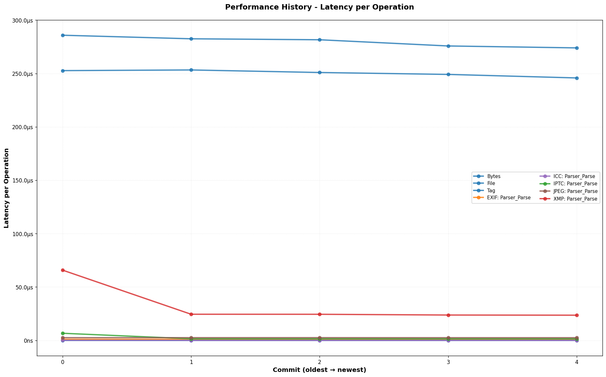
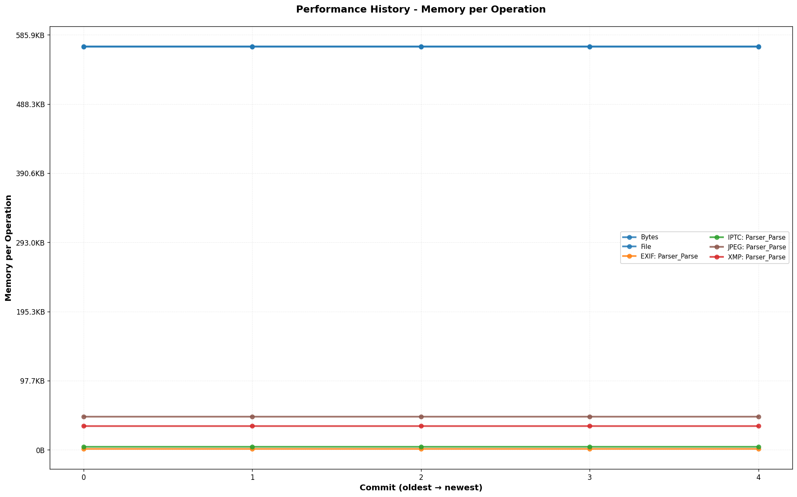
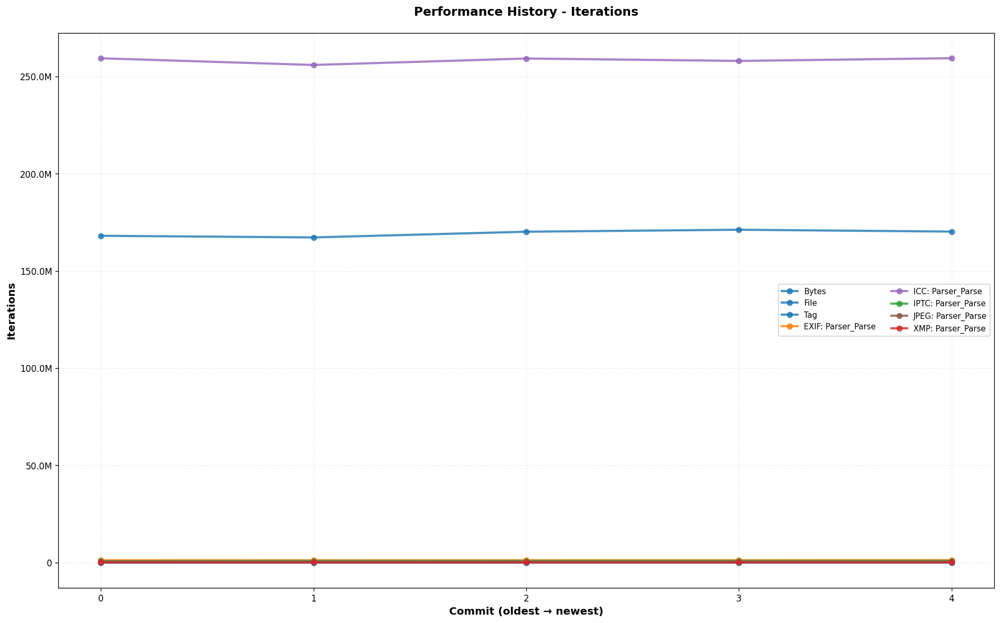
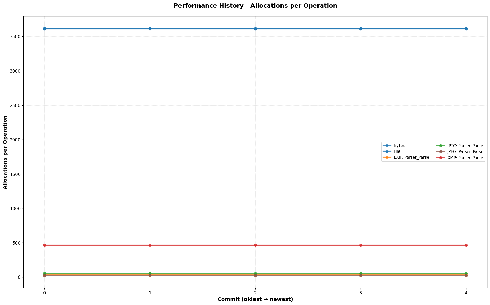

# imx

[](https://pkg.go.dev/github.com/gomantics/imx)
[](https://github.com/gomantics/imx/actions/workflows/ci.yml)
[](https://goreportcard.com/report/github.com/gomantics/imx)
[](https://opensource.org/licenses/MIT)

Fast, dependency-free image metadata extraction for Go. Extract EXIF, IPTC, XMP, and ICC color profile data from images.

## Features

- **Zero dependencies** - Pure Go, stdlib only, no CGO
- **Streaming I/O** - Memory efficient, never loads entire files
- **Multiple formats** - JPEG (more formats coming soon)
- **Multiple metadata types** - EXIF, IPTC, XMP, ICC profiles

## Installation

```bash
go get github.com/gomantics/imx
```

### CLI Tool

```bash
go install github.com/gomantics/imx/cmd/imx@latest
```

## Quick Start

```go
package main

import (
    "fmt"
    "log"

    "github.com/gomantics/imx"
)

func main() {
    // Extract metadata from a file
    meta, err := imx.MetadataFromFile("photo.jpg")
    if err != nil {
        log.Fatal(err)
    }

    // Access common EXIF tags using constants
    if tag, ok := meta.Tag(imx.TagMake); ok {
        fmt.Printf("Camera: %v\n", tag.Value)
    }
    if tag, ok := meta.Tag(imx.TagModel); ok {
        fmt.Printf("Model: %v\n", tag.Value)
    }
    if tag, ok := meta.Tag(imx.TagDateTimeOriginal); ok {
        fmt.Printf("Date: %v\n", tag.Value)
    }
}
```

## API Overview

### Convenience Functions

These package-level functions use a shared default extractor and are safe for concurrent use. All functions accept optional configuration:

```go
// From file path
meta, err := imx.MetadataFromFile("photo.jpg")

// From io.Reader
meta, err := imx.MetadataFromReader(reader)

// From byte slice
meta, err := imx.MetadataFromBytes(data)

// From URL
meta, err := imx.MetadataFromURL("https://example.com/photo.jpg")

// With options
meta, err := imx.MetadataFromFile("photo.jpg",
    imx.WithMaxBytes(5<<20),     // Limit to 5MB
    imx.WithBufferSize(64*1024), // 64KB buffer
)
```

### Using the Extractor

For more control or when processing many files, create a reusable `Extractor`.

```go
extractor := imx.New(
    imx.WithMaxBytes(10<<20),              // Limit to 10MB
    imx.WithBufferSize(128*1024),          // 128KB buffer
    imx.WithStopOnFirstError(true),        // Stop on first parser error
    imx.WithHTTPTimeout(30*time.Second),   // HTTP timeout for URLs
)

meta, err := extractor.MetadataFromFile("photo.jpg")
```

### Iterating Tags

```go
// Iterate all tags
meta.Each(func(dir imx.Directory, tag imx.Tag) bool {
    fmt.Printf("%s:%s = %v\n", dir.Name, tag.Name, tag.Value)
    return true // continue iteration
})

// Iterate tags in a specific spec
meta.EachInSpec(imx.SpecEXIF, func(tag imx.Tag) bool {
    fmt.Printf("%s = %v\n", tag.Name, tag.Value)
    return true
})
```

### Batch Retrieval

```go
// Get multiple tags at once
values := meta.GetAll(imx.TagMake, imx.TagModel, imx.TagISO)
for id, value := range values {
    fmt.Printf("%s: %v\n", id, value)
}
```

## Supported Metadata

| Spec | Description | Status |
|------|-------------|--------|
| EXIF | Exchangeable Image File Format - camera settings, GPS coordinates, timestamps, and device information embedded by cameras and smartphones | ✅ Full support |
| IPTC | International Press Telecommunications Council - industry standard for news and media metadata including captions, credits, and keywords | ✅ Full support |
| XMP | Extensible Metadata Platform - Adobe's XML-based format for extensible metadata used by creative applications | ✅ Full support |
| ICC | International Color Consortium - color profile data describing color space characteristics for accurate color reproduction | ✅ Full support |

## Supported Formats

| Format | Status |
|--------|--------|
| JPEG | ✅ Full support |
| PNG | 🔜 Planned |
| WebP | 🔜 Planned |
| TIFF | 🔜 Planned |
| HEIF/HEIC | 🔜 Planned |
| AVIF | 🔜 Planned |

## CLI Usage

```bash
# Basic extraction
imx photo.jpg

# JSON output
imx --format json photo.jpg

# Filter by spec
imx --spec exif photo.jpg

# Get specific tag
imx --tag Make photo.jpg

# Process multiple files
imx --recursive ./photos/

# Read from stdin
cat photo.jpg | imx --stdin
```

## Performance

imx is designed for high performance:

- **Streaming** - Uses `bufio.Reader`, never loads entire files into memory
- **Minimal allocations** - Reuses buffers where possible
- **Early termination** - Stops parsing after metadata segments
- **Concurrent safe** - Extractor can be shared across goroutines

### Benchmarks

**Latest Results** *(Apple M4 Pro, Go 1.23)*:

```
High-Level API
Benchmark                      Iterations   Latency/op      B/op    allocs/op
MetadataFromFile                    4.33K     281.48µs   569.54KB        3.62K
Metadata_Tag                      171.29M       6.96ns          -            -

EXIF Parser
Parser_Parse                        1.19M       1.00µs     1.59KB        31.00

IPTC Parser
Parser_Parse                      791.12K       1.50µs     4.53KB        54.00

XMP Parser
Parser_Parse                       47.47K      24.17µs    33.57KB       462.00

ICC Parser
Parser_Parse                      256.61M       4.57ns          -            -

JPEG Format
Parser_Parse                      454.89K       2.62µs    46.80KB        24.00
```

**Performance Trends**:

<details>
<summary>View Historical Performance Graphs</summary>


*Latency per operation across recent commits*


*Memory allocated per operation*


*Benchmark iterations (higher is better)*


*Number of allocations per operation*

</details>

**Continuous Benchmarking**:
- Graphs auto-updated on every commit to main
- Automatic regression detection with 120% threshold
- Performance alerts on PRs

**Run Benchmarks**:
```bash
# Run benchmarks with comprehensive human-readable report
make bench

# Run benchmarks + generate historical performance graphs
make bench N=50         # Last 50 commits
```

The benchmark tool provides:
- **Human-readable report** with performance metrics grouped by category
- **Summary statistics** showing fastest/slowest benchmarks
- **Multiple metrics**:
  - **Ops/Sec** - Operations per second (throughput)
  - **ns/op** - Nanoseconds per operation (latency)
  - **MB/s** - Megabytes per second (data throughput)
  - **B/op** - Bytes allocated per operation (memory usage)
  - **allocs/op** - Number of allocations per operation

**Historical Performance Graphs**:

Generate performance trend graphs across git history:

```bash
make bench N=50     # Creates graphs in out/ directory
```

Generates graphs showing trends over time:
- `out/latency.png` - Latency (ns/op) across commits
- `out/memory.png` - Memory allocations (B/op) across commits
- `out/iterations.png` - Benchmark iterations across commits
- `out/allocs.png` - Allocation count (allocs/op) across commits

**Requirements**: Python 3 with matplotlib for graphs (`pip3 install matplotlib`)

**Tools**:
- Results tracked via [github-action-benchmark](https://github.com/benchmark-action/github-action-benchmark)
- Historical visualization using Python + matplotlib

## Contributing

Contributions are welcome! Please see [CONTRIBUTING.md](CONTRIBUTING.md) for development guidelines

## License

MIT License - see [LICENSE](LICENSE) for details.

